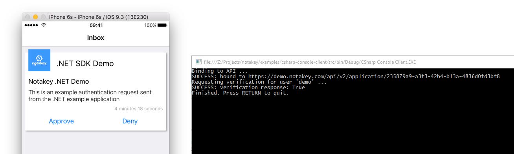

# csharp-console-client

Console application that sends a verification request to 'demo.notakey.com' and awaits result

## Installing Notakey.SDK

The application relies on the NuGet package [Notakey.SDK](https://www.nuget.org/packages/Notakey.SDK/):

    Install-Package Notakey.SDK

## Using the SDK

To use it, you need:

- a valid Notakey server API endpoint
- a valid Notakey application AccessId value (on the same server)
- an onboarded user, which can approve authentication requests in this application

## Demo environment

For testing, we have provided a default (shared) environment:

- service domain demo.notakey.com
- application .NET SDK Demo (with AccessId 235879a9-a3f3-42b4-b13a-4836d0fd3bf8)
- user 'demo' with password 'demo'

After onboarding this user in the Notakey Authenticator mobile application, and running this demo, you should
receive authentication requests.

### Expected output



## Basic usage

Binding to API with client ID or existing access token.

```csharp

// Initialize SDK with service URL and access ID, that is available in service dashboard
var api = new NtkService("https://example.com/api", "<accessId>");

// Bind to API with registered client ID and secret
api
    .Bind("<client>",
        "<secret>",
            new List<string> { "urn:notakey:auth", "urn:notakey:keyservice" })
    .SingleAsync()
    .Subscribe(myToken => OnBound(myToken, api), OnBindError);
// OnBound returns AccessToken instance that can be stored for reuse.
```

Authentication request verification.

```csharp
api
    .PerformFullVerification(userName, "Notakey .NET Demo", "This is an example authentication request sent from the .NET example application", Path.GetRandomFileName())
    .SingleAsync()
    .Subscribe(resp => OnVerificationResponse(resp), OnVerificationError);

// OnVerificationResponse contains AuthResponse that includes user identity attributes and issued KeyToken.
```

See Program.cs for implementation details.

## Message encryption

This functionality allows users to exchange encrypted data payloads where payloads are protected by end-to-end encrytion.

* User authenticates using Notakey Authenticator when starting client application.
* After approved authentication request user is issued a keytoken, a token string.
* Client application uses keytoken to register public key in service registry.

```csharp
// Cryptographic API can be initialized with bound API refrence (api), INtkCypherStore reference (keyStore).
var crypto = new NtkCypher(api, keyStore);

// Call BootstrapEntity to create a new keypair for user and register public key in KeyService registry.
// This allows any member of service send encrypted messages addressed to this public key.
var owner = crypto.BootstrapEntity(keyToken);
// Returned NtkCryptoEntity can be serialized and stored for later message reception.
// owner.Pkey.Uuid is the unique public key ID that can be used to address messages to specific user on this device.
```

```csharp
// Recover already registered NtkCryptoEntity by passing it to constructor ...
var crypto = new NtkCypher(api, keyStore, owner);
// ... and call RecoverEntity.
var crypto.RecoverEntity(owner);
// owner.Pkey.Uuid (NtkCryptoEntity Uuid) is the unique public key ID that can be used to address messages to specific user on this device.
```
* Client announces it's NtkCryptoEntity Uuid to other members of this service, to be able to receive messages
* Client encrypts messages addressed to specific receiver's NtkCryptoEntity Uuid

```csharp
// Send message using receiver's NtkCryptoEntity UUID.
// SDK returns encrypted message, the actual transmission has to be done in client application.
var mycypher = crypto.SendTo(receiverUuid, myMessageBytes);
```

* Client application sends encrypted payload to receiver

* Receiver decrypts messages by calling ReceiveMsg with received payload

```csharp
// Decrypt message on receiver with ReceiveMsg
var otherCrypto = new NtkCypher(api, keyStore, owner);
var res = otherCrypto.ReceiveMsg(mycypher)
```

To perform message encryption you must implement INtkCypherStore interface that takes care of public key caching and private key storage.

## AccessToken

In cases where API client ID and secret cannot be stored in client application (e.g. mobile app), it is possible to perform API binding on
server side application and initialize only AccessToken in client application, leaving client credentials on server side.

```csharp
// Bind to API can also be done using AccessToken that is stored in client
var accessToken = new AccessToken(){ Token = "my issued token", Expires = 3600, CreatedAt = DateTimeOffset.UtcNow.ToUnixTimeSeconds() };
api
    .Bind(accessToken)
    .SingleAsync()
    .Subscribe(myToken => OnBound(myToken, api), OnBindError);

```